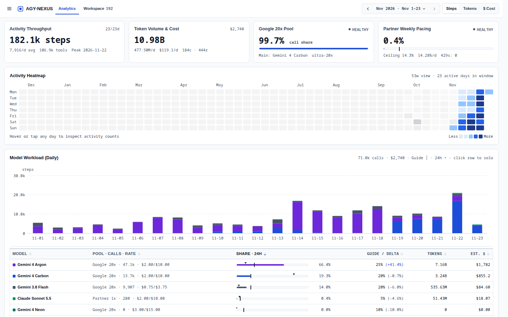

# `agy-nexus-mcp` — Connect Google Gemini to Your Antigravity IDE, 2-Pane Workspace & Usage Studio (`v4.0.3`)

`agy-nexus-mcp` is a self-hosted **Dual-Doorway Model Context Protocol (MCP)** server connecting **Google Gemini** (Web, Mobile & Tasks) directly to your local **Google Antigravity IDE / CLI** workstation—paired with **`agy-praxis-mcp`** (deadbolt-free LAN-only semantic codebase index & `<repo-slug>-NN` handoff inbox) and the **Quiet UI `v9.3.0` Studio PWA (`/web`)** featuring live **8-Model Micro-USD Analytics**, **Multi-Column Sortable Tables**, **Desktop Sidebar Pinning**, and a **2-Pane Session Workspace Explorer**.

> **[Try the Interactive Live Showcase (Real Workstation Telemetry, 0 Backend Required)](https://FrankXLT.github.io/agy-nexus-mcp/)**

---

## Live `/web` Unified Studio App (`Analytics` + 2-Pane `Workspace`)

### 1. `Analytics` — 8-Model Cost Ledger, Active-Day Whiskers & `Mon–Sun` Calendar Matrix


### 2. `Workspace` — Responsive 2-Pane Session Explorer, Editorial Reader & Capture Gallery


<details>
<summary><strong>📱 Mobile Layouts (<code>390px</code> Portrait — Analytics <code>26w</code> Matrix &amp; Clean Wrapped Workspace Tabs)</strong></summary>


</details>

---

## Key Capabilities (`v4.0.3`)

- **Dual-Doorway Parallel Isolation & `<repo-slug>-NN` Queue**: Concurrent Gemini Web/Mobile tabs work across separate repositories via `fcntl.flock` `active_contexts` slots (auto-pruning stale slots), 3-pillar fail-closed resolution (`target_resolver.py`), same-repo concurrent writer detection (`MAIN WRITER` / `WORKTREE` / `SHARED`), and atomic `<slug>-NN` handoffs (`handoff_queue.py`) with proportional **Surgical Fast-Path** vs. Full Dual-Review execution (`handoff_templates.py`).
- **8-Model Registry, Effective-Dated Cost Ledger & `01:45 AM` Drift Watchdog**: Tracks all 8 live models (`Gemini 4 Carbon`, `Neon`, `Argon`, `Hydrogen`, `Gemini 3.8 Flash`, `Claude Opus 5.5`, `Claude Sonnet 5.5`, `GPT-OSS 120B`) with immutable micro-USD epochs (`CACHE_VERSION = 8`, `cost_ledger.json`), deadbolt-safe `76`-col `models` ASCII status, `12`-subagent `sync_agents.py`, and read-only `01:45 AM` `agy-model-drift-check.timer`.
- **`agy-praxis-mcp` Local IDE Doorway (`6` Tools)**: Incremental SHA-256 Polyglot semantic indexing (`polyglot_map` strictly `<= 17.5 KB` with `directory_summary` + `drilldown_hint`, `polyglot_search`, `polyglot_outline`) + `<repo-slug>-NN` handoff queue (`/praxis/{PRAXIS_MCP_TOKEN}/mcp`, legacy `/polyglot/` alias, or `--stdio`) with strict LAN-only `403` proxy/Origin rejection.
- **Strict `< 20 KB` Wire Budget, Continuity Rollover & In-Place Closeout**: Sequential Read-Only Governance (`<= 4` hops/turn), `tools/list` (`<= 8.6 KB`), `get_session_tree` (`<= 17.5 KB`), `<= 18.5 KB` inner / `<= 19.8 KB` escaped outer wire caps, 5-tier context pressure (`FRESH` $\rightarrow$ `HARD_ROLLOVER`), `RETIRED.json` tombstones (`retire_after_closeout=True`), and `workflow:baseline`.
- **Quiet UI `v9.3.0` Studio (`/web`) & Public Interactive Showcase**: Direct `/web` live cutover (`/web/v9` compatible), offline vendored Apache ECharts, `[Steps | Tokens | $ Cost]`, multi-column sortable tables (`Age`, `Est. $`, `Tokens`, `Steps`, `Share`, `Status`) with preserved swatch colors, `>= 1100px` desktop sidebar pinning (`☰` / `◧`), `Activity by Hour of Day` active-day `Min / Avg / Max + Last 24h` whiskers, `Subscription Break-Even`, responsive `< 760px` Docs + `[Captures (N)]` modal, and zero-leak **GitHub Pages Showcase** (`scripts/build_github_showcase.py`).

---

## Quick Setup & Everyday Prompts

1. **Initialize & Self-Test**: Clone the repo, run `./scripts/setup.sh` (or `.\scripts\setup.ps1` / `python3 scripts/init_secrets.py --passphrase "..."`), then verify & start:
   ```bash
   python3 ag_bridge.py --self-test && python3 -m agy_nexus.tools_praxis --self-test && pytest
   python3 ag_bridge.py   # or docker compose up -d (see docs/DEPLOYMENT.md)
   ```
2. **Connect Clients**:
   - **Gemini Web / Mobile / Tasks**: Add custom MCP `https://<your-domain>/{PATH_SECRET}/mcp` (voice/text unlock strips filler via `unlock_sessions`).
   - **Antigravity IDE (`agy-praxis-mcp`)**: Point `~/.gemini/config/mcp_config.json` to `http://<host>.lan:8765/praxis/<PRAXIS_MCP_TOKEN>/mcp`.
   - **Quiet UI Studio PWA (`/web`) & Public Demo**: Open `https://<your-domain>/web` (`?demo=1` for depersonalized preview) or explore the [Public GitHub Pages Showcase](https://FrankXLT.github.io/agy-nexus-mcp/).
3. **Example Prompts**: *"Unlock Antigravity with [phrase] and load `agy-nexus-mcp`"* · *"Show me my session tree"* · *"Show model & subagent status"* · *"Search `cloud-gitops-stack` for compose healthcheck rules"* · *"Stage this bugfix (`allow_chained_publish=False`)"* · *"Show me my latest usage stats (`default` / `quick` / `rich`)."*

---

## Project Manager Mode & Plain-Language Handoffs (`v4.0.3`)

`agy-nexus-mcp` turns Google Gemini into a grounded **Engineering Project Manager**: Gemini scouts live state sequentially (`<= 4` calls/turn), stages `<repo-slug>-NN` handoffs with proportional `execution_mode="auto"` ceremony (`allow_chained_publish=False` for preview gates with 7-day `/web/media/` screenshots), and guides **Job-First `"Yes"`** transitions across `ready_to_run` (staged tickets), `in_flight` (running tasks), and `ready_to_ship` (in-place `retire_session=True` + `RETIRED.json` closeout).

| `handoff_mode` | Purpose & Behavior | Antigravity Execution |
| :--- | :--- | :--- |
| **`feature_update`** *(Default)* | Add features or refine workflows with `WORKFLOWS.md` baseline parity. | Full 4-Step (`flash-scout` $\rightarrow$ `surgeon` $\rightarrow$ `flash-auditor` $\rightarrow$ Dual-Review / Visual Gate; multi-deliverable/complex `fast` coerces to `plan`). |
| **`new_project`** | Stand up greenfield repos/packages (`create_new_project=True`, `<= 500L` modules). | Blueprinted via `argon-architect` (`plan` mode enforced), scaffolded modularly with `pytest` & self-tests. |
| **`bug_or_visual_fix`** | Pinpoint broken behavior, exact viewports (`390px`/`900px`/`1440px`/`2560px`), and fix criteria. | **Surgical Fast-Path** for compact non-security diffs (`fast`), or Full Dual-Review on auth/UI boundaries. |
| **`release_closeout`** | Verify tests, sync 3-2-1 backups, commit/tag/push, and write `RETIRED.json` tombstones. | Prunes worktrees, marks `<slug>-NN` tickets `COMPLETED`, defers `RETIRED.json` (`retire_after_closeout=True`) on headless runs until commit+push succeed. |

---

## Copy-Ready 76-Column Project, Chat & Session Hierarchy (`get_session_tree`)

Call `get_session_tree()` (or `manage_background_run(action="sessions")`) to render a copy-ready 76-column ASCII hierarchy grouping every conversation and staged `<repo-slug>-NN` handoff under its parent project with **untruncated** `project_id`, `session_id`, and `workspace` lines:

```text
╔══════════════════════════════════════════════════════════════════════════╗
║ AGY-NEXUS v4.0.3 // PROJECT -> CHAT -> SESSION ID HIERARCHY (COPY-READY) ║
╠══════════════════════════════════════════════════════════════════════════╣
║ SLOTS: 3 | STAGED: 1 | IN-WORK: 3 | PINNED: 24 | TTL: 119.5m             ║
║ 3-2-1 BACKUP: 03fb59e (SYNCED ✓ · 19890.5 KB · 2h ago)                   ║
╚══════════════════════════════════════════════════════════════════════════╝

[PROJECT 1] AGY Nexus MCP [SHARED REPO] [▶ 1 IN-WORK]
  project_id : f1378431-5b09-4545-a48c-ac5c67c04fd3
  workspaces : /home/dev/agentic_workspace/projects/agy-nexus-mcp
  ├─ [HANDOFF agy-nexus-mcp-44] AGY-Nexus v4.0.3 — Sortable Tables, Desktop Sidebar Pinning & Opus 5.5 Drift Fix
  │   pass_off   : [▶ IN-WORK] · plan/feature_update · 40m ago
  │   session_id : ab5f045b-853e-4020-88bd-29d10b438dee
  ├─ [HANDOFF agy-nexus-mcp-43] AGY-Nexus v4.0.2 — Heatmap Quartiles, Out-of-Window Dimming & Full-Width 52w Strip
  │   pass_off   : [✓ COMPLETED] · fast/bug_or_visual_fix · 9h ago
  │   session_id : 67668d0b-a82c-430c-b7e1-362dbff9a5e5
  ├─ (+16 older completed)
  ├─ [#1] AGY-Nexus v4.0.3 — Sortable Tables, Desktop Sidebar Pinning & Opus 5.5 Drift Fix
  │   session_id : ab5f045b-853e-4020-88bd-29d10b438dee
  │   workspace  : /home/dev/agentic_workspace/projects/agy-nexus-mcp
  │   status     : [● RUNNING] · MAIN WRITER · 185 steps · 9s ago
  ├─ [#7] AGY-Nexus v4.0.2 — Heatmap Quartiles, Out-of-Window Dimming & Full-Width 52w Strip
  │   session_id : 67668d0b-a82c-430c-b7e1-362dbff9a5e5
  │   workspace  : /home/dev/agentic_workspace/projects/agy-nexus-mcp
  │   status     : [◉ PINNED · IDLE] · SHARED (READ-ONLY) · 287 steps · 9h ago
  └─ [#17] AGY-Nexus v4.0.1 — Fix 4 Google AI Subscription Tiers ($4.99/$19.99/$99.99/$199.99) & Publish
      session_id : 0b7eeb72-6d50-4044-a6a0-90f8faeb2ff1
      workspace  : /home/dev/agentic_workspace/projects/agy-nexus-mcp
      status     : [○ COMPLETED] · SHARED (READ-ONLY) · 280 steps · 15h ago

[PROJECT 2] Stem Curriculum Lab [SHARED REPO] [◈ 1 STAGED] [▶ 1 IN-WORK]
  project_id : 8d13c66f-569c-42e0-a57e-dd4b111ab5f2
  workspaces : /home/dev/agentic_workspace/projects/stem-curriculum-lab
  ├─ [HANDOFF stem-curriculum-lab-60] [SCL-Core] Stepped & Hex Domain Mosaics + Skill Trees
  │   pass_off   : [◈ STAGED · UNCLAIMED] · plan/feature_update · 4d ago
  │   session_id : (unclaimed · new chat)
  ├─ [HANDOFF stem-curriculum-lab-85] [SCL-Portal] Landing Page, Control-Plane & OIDC Auth
  │   pass_off   : [▶ IN-WORK] · plan/feature_update · 1h ago
  │   session_id : a5e6835f-4158-4fcb-a54c-fc6a9879a09a
  ├─ (+12 older completed)
  ├─ [#2] [SCL-RF] Ch. I–VIII Interactive Signal Modules Overhaul
  │   session_id : a5e6835f-4158-4fcb-a54c-fc6a9879a09a
  │   workspace  : /home/dev/agentic_workspace/projects/stem-curriculum-lab
  │   status     : [● RUNNING] · MAIN WRITER · 607 steps · 54s ago
  ├─ [#8] [SCL-Portal] Landing Page, Control-Plane & OIDC Auth
  │   session_id : 1545ffde-29a4-4e5f-8232-fdd077bc3d8b
  │   workspace  : /home/dev/agentic_workspace/projects/stem-curriculum-lab
  │   status     : [◉ PINNED · IDLE] · SHARED (READ-ONLY) · 741 steps · 9h ago
  └─ [#15] [SCL-RF] Ch. I–VIII Interactive Signal Modules Overhaul
      session_id : 793805e4-320c-4d63-a627-b5448ca2ba0f
      workspace  : /home/dev/agentic_workspace/projects/stem-curriculum-lab
      status     : [○ COMPLETED] · SHARED (READ-ONLY) · 1,035 steps · 11h ago

[PROJECT 3] Quiet UI Skills [SHARED REPO] [▶ 1 IN-WORK]
  project_id : 696506de-5df1-41da-9b5c-03c2e1b9128c
  workspaces : /home/dev/agentic_workspace/projects/quiet-ui-skills
  ├─ [HANDOFF quiet-ui-skills-46] Quiet UI Skills v9.5.0 R2 — Unified Picker, Rich Stage Interactions, Smart Glass & Kiosk Polish, NIST Standards Landing
  │   pass_off   : [▶ IN-WORK] · plan/feature_update · 39m ago
  │   session_id : cc2f38c4-f495-4625-b6d6-3cc460dfc01c
  ├─ [HANDOFF quiet-ui-skills-45] Quiet UI Skills v9.5.0 — SCL Landing Page, Light Topbar, 1080p Portal, Preset Stepping & Interactive Rail
  │   pass_off   : [✓ COMPLETED] · plan/feature_update · 1h ago
  │   session_id : a599d9ba-32a5-4a78-bd5b-6afcc0bcdc9b
  ├─ (+20 older completed)
  ├─ [#3] Quiet UI Skills v9.5.0 R2 — Unified Picker, Rich Stage Interactions, Smart Glass & Kiosk Polish, NIST Standards Landing
  │   session_id : cc2f38c4-f495-4625-b6d6-3cc460dfc01c
  │   workspace  : /home/dev/agentic_workspace/projects/quiet-ui-skills
  │   status     : [● RUNNING] · MAIN WRITER · 275 steps · 4m ago
  ├─ [#4] Quiet UI Skills v9.5.0 — SCL Landing Page, Light Topbar, 1080p Portal, Preset Stepping & Interactive Rail
  │   session_id : a599d9ba-32a5-4a78-bd5b-6afcc0bcdc9b
  │   workspace  : /home/dev/agentic_workspace/projects/quiet-ui-skills
  │   status     : [◉ PINNED · IDLE] · SHARED (READ-ONLY) · 452 steps · 2h ago
  └─ [#6] Quiet UI Skills v9.4.0 Wave 2 — Cleanfield Workbench Archetypes, Flow Primitives & Brownfield CDP Probes
      session_id : 0b9b559c-8aee-49b1-97e8-ffd906b5744b
      workspace  : /home/dev/agentic_workspace/projects/quiet-ui-skills
      status     : [○ COMPLETED] · SHARED (READ-ONLY) · 431 steps · 8h ago
```

---

## Three-Tier ASCII Usage Reports in Chat

Ask Gemini for your usage stats (`get_session_tree(include_stats=True, period="last_90d", style=...)` or `manage_background_run(action="stats", ...)`) to render live Dual-Pool quota pacing, `Mon–Sun` calendar heatmaps, sub-daily curves, and workspace/subagent token breakdowns in **three plain-text layouts**:

| Style | Width | Best For | What It Shows |
| :--- | :---: | :--- | :--- |
| **`style="default"`** | **72 cols** | Standard Desktop & Tablet Chat | Split summary header, 22-week `Mon–Sun` heatmap, 8-hour activity & project stack (`░▒▓█`), model quota bars (`┼`), Praxis/Polyglot health, and project & subagent tables. |
| **`style="quick"`** | **`<= 40` cols** | Phone Screens (Portrait) | Fits strictly within 40 characters per line so it never wraps on mobile. Shows a 13-week heatmap, 8-hour pace curve, model quota bars, and top projects/subagents. |
| **`style="rich"`** | **76 cols** | Widescreen Desktop Chat | Full box-drawn rig (`v4.0.3`) with side-by-side quota and token panels, 13-week 3-character heatmap with Peak Day card, 6-row 8-hour curve, and share gauges. |

### 1. `style="default"` (72-Column Standard Layout)

```text
════════════════════════════════════════╤═══════════════════════════════
AGY-NEXUS v4.0.3 // 91d (Nov 23 ◄── Aug ┆ Up to Date (v4.0.3)           
════════════════════════════════════════╪═══════════════════════════════
GOOGLE 20x :  99.8% [████████┼█] HEALTHY┆ 0x 429s | Ultra-20x (T:>=90%) 
PARTNER 1x :  99.8% [░┼░░░░░░░░] ON PACE┆ 85.7% Wk Left | Lim <=14.3%/d 
STEPS/TOOLS: 260,123s | 134,053t | 197c ┆ 5,002 s/act-d | 2,858 s/cal-d 
TOKEN BURN : ~12.5B | $3,106.24         ┆ 240.5M/d | $59.74/d (636r)    
MCP WIRE   : 96% <20KB (avg 13.7/37.9KB)┆ 122 req (470k tok) | Web+Praxi
CODE HEALTH: Poly 2439 syms | 85/85 <=50┆ 0 >650L | Praxis+Serena       
────────────────────────────────────────┴───────────────────────────────
DAILY HEATMAP (NOW: W01 ──► 22w AGO)   Peak: 11/22 (20,916s) | Act: 52d
Wk    01 02 03 04 05 06 07 08 09 10 11 12 13 14 15 16 17 18 19 20 21 22
Mon   ▒▒ ██ ▓▓ ▒▒ ▓▓ ░░ ░░ ·· ░░ ·· ·· ·· ·· ·· ·· ·· ·· ·· ·· ·· ·· ··
Tue   ·· ██ ▓▓ ▒▒ ▒▒ ░░ ░░ ·· ·· ░░ ·· ·· ·· ·· ·· ·· ·· ·· ·· ·· ·· ··
Wed   ·· ██ ▓▓ ▓▓ ▒▒ ·· ░░ ·· ░░ ░░ ·· ·· ·· ·· ·· ·· ·· ·· ·· ·· ·· ··
Thu   ·· ██ ▒▒ ▒▒ ▒▒ ░░ ░░ ·· ·· ▒▒ ·· ·· ·· ·· ·· ·· ·· ·· ·· ·· ·· ··
Fri   ·· ██ ██ ▓▓ ▒▒ ▓▓ ░░ ·· ▒▒ ▓▓ ·· ·· ·· ·· ·· ·· ·· ·· ·· ·· ·· ··
Sat   ·· ██ ██ ██ ██ ▓▓ ░░ ·· ▓▓ ▒▒ ·· ·· ·· ·· ·· ·· ·· ·· ·· ·· ·· ··
Sun   ·· ██ ██ ██ ▓▓ ▓▓ ▒▒ ·· ▓▓ ·· ·· ·· ·· ·· ·· ·· ·· ·· ·· ·· ·· ··
Vol   ▁▁ ██ ▄▄ ▃▃ ▃▃ ▂▂ ▁▁ ── ▁▁ ▁▁ ── ── ── ── ── ── ── ── ── ── ── ──
────────────────────────────────────────────────────────────────────────
8H SUB-DAILY PACE (NOW ──► SEP 21)   [Avg: 367/8h | Peak: 1.0k | ░▒▓█]
1.0k ╷ █  █                                                            
 531 ┤██  █    ▄      █      █                                         
 367 ┼███─█───██──────█▄─────█──▄───────█──────────────────────────────
   0 ╵███ █   █▒     ▄██ ▄   ░ ▄▓▄▓     ▓ ▄▄   ▄         ░░            
     └─▲────────────▲────────────▲────────────▲────────────▲──────────▲─
      Nov 23       Nov 10       Oct 28       Oct 15       Oct 02     Sep
      Stack: [█] stem-curricul (22%)  [▓] home-telemetr (12%)  [▒] mail-
────────────────────────────────────────────────────────────────────────
MODEL       [QUOTA ┼ TARGET] SHARE    CALLS     TOK    EST.$  DLT  STAT
Carbon 4    [██░┼░░░░░░░░░░] 10.9%  13,125    3.1B  $822.8   -9% OK  
Neon 4      [░┼░░░░░░░░░░░░]  0.0%       0       0   $0.00  -10% OK  
Argon 4     [███┼███░░░░░░░] 46.7%  56,498    8.3B  $2,118  +22% WARN
Hydrogen 4  [░░┼░░░░░░░░░░░]  0.0%       0       0   $0.00  -15% WARN
Flash 3.8   [███┼██▓░░░░░░░] 42.2%  51,029    1.0B  $151.1  +22% WARN
Opus 5.5    [▏░░░░░░░░░░░░░]  0.0%       0       0   $0.00   -3% OK  
Sonnet 5.5  [░┼░░░░░░░░░░░░]  0.2%     272   41.2M   $14.7   -5% OK  
GPT-OSS 120 [▏░░░░░░░░░░░░░]  0.0%       0       0   $0.00   -2% OK  
BILLING    Hist:$3,106 API | NextRate:$6,198 (+100%) | 20x:5.1x
────────────────────────────────────────────────────────────────────────
WORKSPACES (15)  CHATS  STEPS    TOK   TOK/D   TOK/WK   EST.$  SHARE
1. stem-curricul  67c 56,483    3.3B  64.4M  450.6M  $825.2  21.7%
2. home-telemetr   4c 31,515    2.0B  37.6M  263.1M  $481.2  12.1%
3. mail-triage-u  30c 31,145    2.1B  39.9M  279.4M  $428.6  12.0%
4. task-queue-en   1c 25,933  346.9M  6.67M   46.7M   $96.3  10.0%
5. quiet-ui-skil  33c 24,997    1.5B  28.9M  202.4M  $424.5   9.6%
6. net-topology-   5c 19,487  860.1M  16.5M  115.8M  $199.6   7.5%
7. agy-nexus-mcp  25c 19,082    1.2B  23.7M  165.6M  $328.2   7.3%
8. cloud-gitops-   4c 15,070   52.7M  1.01M   7.10M   $11.9   5.8%
9. edge-iot-cont   6c 12,250    9.5M   182k   1.28M   $1.51   4.7%
10. agent-harnes   8c  9,457  485.1M  9.33M   65.3M  $123.7   3.6%
11. scratch-prot   8c  7,797  350.8M  6.75M   47.2M  $110.1   3.0%
12. container-gi   4c  4,995  247.0M  4.75M   33.2M   $69.3   1.9%
13. astro-sky-ma   1c  1,126    294k   5.7k     40k   $0.02   0.4%
14. rf-dsp-modem   0c    609   34.6M   665k   4.66M   $4.37   0.2%
15. civic-map-en   1c    177    6.9M   133k    933k   $1.74   0.1%
────────────────────────────────────────────────────────────────────────
SUBAGENTS (10)    RUNS  STEPS    TOK   TOK/D   TOK/WK   EST.$  SHARE
1. flash-surgeon 154r 26,152  369.9M  7.11M   49.8M   $51.0  28.6%
2. argon-sentine 126r 24,499    1.2B  22.6M  158.1M  $419.1  26.8%
3. flash-auditor 190r 15,800  419.2M  8.06M   56.4M   $64.5  17.3%
4. research       75r  9,449  396.2M  7.62M   53.3M  $147.4  10.3%
5. argon-surgeon  13r  8,185  524.5M  10.1M   70.6M  $121.9   9.0%
6. flash-scout    64r  6,197  157.8M  3.04M   21.2M   $24.5   6.8%
7. claude-sentin  10r    882   41.7M   802k   5.61M   $14.7   1.0%
8. argon-archite   2r    132    3.8M    74k    518k   $1.79   0.1%
9. carbon-sentin   1r     60    3.0M    57k    402k   $1.35   0.1%
10. claude-speci   1r     31   11.8k    227    1.6k   $0.00   0.0%
════════════════════════════════════════════════════════════════════════
```

### 2. `style="quick"` (40-Column Mobile Layout)

```text
════════════════════════════════════════
AGY-NEXUS v4.0.3 // 91d (Nov 23 ◄── Aug 
════════════════════════════════════════
G-20x: 100% [████████┼█] OK | 0x 429s
P-1x : 100% [░┼░░░░░░░░] OK | 86% WkLft
Steps:260.1k | Tools:134.1k | Act:52d
Burn:12.5B | $3,106 | 240.5M/d
Health: Poly 2439s | 85/85 <=500L | up_t
────────────────────────────────────────
HEATMAP (NOW ──► 13w Ago)  │ PEAK & VOL
Mo ▒█▓▒▓░░·░····           │ Pk: 11/22
Tu ·█▓▒▒░░··░···           │ 20,916 stp
We ·█▓▓▒·░·░░···           │ Avg:5,002/d
Th ·█▒▒▒░░··▒···           │ Cost: $3,10
Fr ·██▓▒▓░·▒▓···           │ Subs : 636r
Sa ·████▓░·▓▒···           │ Tok/d:240.5
Su ·███▓▓▒·▓····           │ Tok/w:1.68B
────────────────────────────────────────
8H PACE & STACK (NOW──►OLD) Pk:1.1k
1.1k╷  █                             
 561┤▄─█▄──────────▄█────────────────
 602┼█ ██  █     ▄▄██         ▄      
   0╵█ ██  ▓     ▓░▓░         ░      
────────────────────────────────────────
MODEL   [PIN]    PCT   TOK  EST.$   DLT
Carbon4 [█┼░░░░░░] 11%  3.1B $822.8  -9
Neon 4  [░┼░░░░░░]  0%     0  $0.00 -10
Argon 4 [██┼█▓░░░] 47%  8.3B $2,118 +22
Hydro 4 [░┼░░░░░░]  0%     0  $0.00 -15
Flash38 [█┼█▓░░░░] 42%  1.0B $151.1 +22
Opus5.5 [▏░░░░░░░]  0%     0  $0.00  -3
Sonn5.5 [▏░░░░░░░]  0% 41.2M  $14.7  -5
GPT-120 [▏░░░░░░░]  0%     0  $0.00  -2
────────────────────────────────────────
WORKSPACES & SUBS  TOK   EST.$  TOK/WK
stem-curriculum  3.3B  $825.2  450.6M
home-telemetry-  2.0B  $481.2  263.1M
mail-triage-ui   2.1B  $428.6  279.4M
task-queue-engi 346.9M   $96.3   46.7M
quiet-ui-skills  1.5B  $424.5  202.4M
net-topology-an 860.1M  $199.6  115.8M
*flash-surgeon  369.9M   $51.0   49.8M
*argon-sentinel  1.2B  $419.1  158.1M
*flash-auditor  419.2M   $64.5   56.4M
════════════════════════════════════════
```

### 3. `style="rich"` (76-Column Widescreen Layout)

```text
╔══════════════════════════════════════════════════════════════════════════╗
║ ▄▀█ █▀▀ █▄█ ▄▄ █▄░█ █▀▀ ▀▄▀ █░█ █▀   v4.0.3 // RICH TELEMETRY RIG        ║
║ █▀█ █▄█ ░█░ ░░ █░▀█ ██▄ █░█ █▄█ ▄█   WINDOW: 91d (Nov 23 ◄── Aug 25)     ║
╠════════════════════════════════════╦═════════════════════════════════════╣
║ QUOTA POOLS & 429 COOLDOWNS        │ STEP & TOOL VELOCITY                ║
║ G-20x:  99.8% [████████┼█] OK      │ Total : 260,123 steps | 134,053 too ║
║ P-1x :  99.8% [░┼░░░░░░░░] OK      │ Active: 5,002 s/act-d (52d active)  ║
║ 429s : 0 events | 85.7% Wk Left    │ Calend: 2,858 s/cal-d (197c, 636r)  ║
╠════════════════════════════════════╬═════════════════════════════════════╣
║ TOKEN BURN & API COST LEDGER       │ MCP WIRE & CLIENT SURFACES          ║
║ Total : ~12.5B | $3,106.24         │ Wire  : 96% <20KB (avg 13.7/37.9KB) ║
║ Daily : 240.5M/d ($59.74/d)        │ Calls : 122 MCP reqs (470k tok)     ║
║ NextRt: $6,197.74 API Forecast     │ Client: Web 61% · Prx 39% · Mob 0%  ║
╠════════════════════════════════════╦═════════════════════════════════════╣
║ VERSION & RELEASE STATUS           │ POLYGLOT & MODULAR CODE HEALTH      ║
║ Installed: v4.0.3 (up_to_date)     │ Poly: 2439s | 85/85 <=500L 0>650L   ║
║ Remote   : v4.0.3                  │ IDE MCP  : agy-praxis-mcp + Serena  ║
╠════════════════════════════════════╩═════════════════════════════════════╣
║ DAILY ACTIVITY MATRIX (NOW: W01 ──► W13)     [·· 0  ░░ <1k  ▒▒ <4k  ██]  ║
║ Wk   W01 W02 W03 W04 W05 W06 W07 W08 W09 W10 W11 W12 W13  ┌─ PEAK DAY ─┐ ║
║ Mon  ▒▒▒ ███ ▓▓▓ ▒▒▒ ▓▓▓ ░░░ ░░░ ··· ░░░ ··· ··· ··· ···  │ Nov 22     │ ║
║ Tue  ··· ███ ▓▓▓ ▒▒▒ ▒▒▒ ░░░ ░░░ ··· ··· ░░░ ··· ··· ···  │ 20,916 stp │ ║
║ Wed  ··· ███ ▓▓▓ ▓▓▓ ▒▒▒ ··· ░░░ ··· ░░░ ░░░ ··· ··· ···  ├────────────┤ ║
║ Thu  ··· ███ ▒▒▒ ▒▒▒ ▒▒▒ ░░░ ░░░ ··· ··· ▒▒▒ ··· ··· ···  │ Act: 52d   │ ║
║ Fri  ··· ███ ███ ▓▓▓ ▒▒▒ ▓▓▓ ░░░ ··· ▒▒▒ ▓▓▓ ··· ··· ···  │ Avg:  5.0k │ ║
║ Sat  ··· ███ ███ ███ ███ ▓▓▓ ░░░ ··· ▓▓▓ ▒▒▒ ··· ··· ···  │ Sub: 636r  │ ║
║ Sun  ··· ███ ███ ███ ▓▓▓ ▓▓▓ ▒▒▒ ··· ▓▓▓ ··· ··· ··· ···  └────────────┘ ║
║ Vol  ▁▁▁ ███ ▄▄▄ ▃▃▃ ▃▃▃ ▂▂▂ ▁▁▁ ─── ▁▁▁ ▁▁▁ ─── ─── ───  PeakWk:83.6k   ║
║ Steps  2k 84k 53k 35k 31k 19k  7k  ·  16k 12k  ·   ·   ·                 ║
╠══════════════════════════════════════════════════════════════════════════╣
║ 8H SUB-DAILY HORIZON CURVE & PROJECT STACK (NOW ──► SEP 21)              ║
║ 1.9k ╷ █        █                                                        ║
║ 1.5k ┤ █       ▄█                                                        ║
║ 1.0k ┤ █      ███                                                        ║
║  470 ┼▄█    █ ███            █    █                                      ║
║  336 ┤██─█─▄█▄███────▄───▄───█─▄──█──▄────────────────────────────────   ║
║    0 ╵██░░▄▒███▒░    ▒▄█ █░░ ▓ ░  ░▄▄░░  ▄▄    ▄                         ║
║      └─▲───────────▲───────────▲───────────▲───────────▲───────────▲───  ║
║       Nov 23      Nov 10      Oct 28      Oct 15      Oct 02      Sep 21 ║
║       Stack: [█]stem-curricu(22%)  [▓]home-telemet(12%)  [▒]mail-triage- ║
╠══════════════════════════════════════════════════════════════════════════╣
║ MODEL       [QUOTA ┼ TARGET] SHARE    CALLS     TOK    EST.$  DLT  STAT  ║
║ Carbon 4    [██░┼░░░░░░░░░░] 10.9%  13,125    3.1B  $822.8   -9% OK      ║
║ Neon 4      [░┼░░░░░░░░░░░░]  0.0%       0       0   $0.00  -10% OK      ║
║ Argon 4     [███┼███░░░░░░░] 46.7%  56,498    8.3B  $2,118  +22% WRN     ║
║ Hydrogen 4  [░░┼░░░░░░░░░░░]  0.0%       0       0   $0.00  -15% WRN     ║
║ Flash 3.8   [███┼██▓░░░░░░░] 42.2%  51,029    1.0B  $151.1  +22% WRN     ║
║ Opus 5.5    [▏░░░░░░░░░░░░░]  0.0%       0       0   $0.00   -3% OK      ║
║ Sonnet 5.5  [░┼░░░░░░░░░░░░]  0.2%     272   41.2M   $14.7   -5% OK      ║
║ GPT-OSS 120 [▏░░░░░░░░░░░░░]  0.0%       0       0   $0.00   -2% OK      ║
║ BILLING CMP: Hist $3,106 | NextRate $6,198 (+100%) | 20x 5.1x            ║
╠══════════════════════════════════════════════════════════════════════════╣
║ WORKSPACES (15)  CHATS   STEPS     TOK   TOK/D   EST.$ SHARE GAUGE       ║
║ 1. stem-curricul  67c  56,483    3.3B  64.4M  $825.2 █▍░░░░ 21.7%        ║
║ 2. home-telemetr   4c  31,515    2.0B  37.6M  $481.2 ▍░░░░░ 12.1%        ║
║ 3. mail-triage-u  30c  31,145    2.1B  39.9M  $428.6 ▍░░░░░ 12.0%        ║
║ 4. task-queue-en   1c  25,933  346.9M  6.67M   $96.3 ▍░░░░░ 10.0%        ║
║ 5. quiet-ui-skil  33c  24,997    1.5B  28.9M  $424.5 ▍░░░░░  9.6%        ║
║ 6. net-topology-   5c  19,487  860.1M  16.5M  $199.6 ▍░░░░░  7.5%        ║
║ 7. agy-nexus-mcp  25c  19,082    1.2B  23.7M  $328.2 ▍░░░░░  7.3%        ║
║ 8. cloud-gitops-   4c  15,070   52.7M  1.01M   $11.9 ▍░░░░░  5.8%        ║
║ 9. edge-iot-cont   6c  12,250    9.5M   182k   $1.51 ▍░░░░░  4.7%        ║
║ 10. agent-harnes   8c   9,457  485.1M  9.33M  $123.7 ░░░░░░  3.6%        ║
║ 11. scratch-prot   8c   7,797  350.8M  6.75M  $110.1 ░░░░░░  3.0%        ║
║ 12. container-gi   4c   4,995  247.0M  4.75M   $69.3 ░░░░░░  1.9%        ║
║ 13. astro-sky-ma   1c   1,126    294k   5.7k   $0.02 ░░░░░░  0.4%        ║
║ 14. rf-dsp-modem   0c     609   34.6M   665k   $4.37 ░░░░░░  0.2%        ║
║ 15. civic-map-en   1c     177    6.9M   133k   $1.74 ░░░░░░  0.1%        ║
╟──────────────────────────────────────────────────────────────────────────╢
║ SUBAGENTS (10)    RUNS   STEPS     TOK   TOK/D   EST.$ SHARE GAUGE       ║
║ 1. flash-surgeon 154r  26,152  369.9M  7.11M   $51.0 █▍░░░░ 28.6%        ║
║ 2. argon-sentine 126r  24,499    1.2B  22.6M  $419.1 █▍░░░░ 26.8%        ║
║ 3. flash-auditor 190r  15,800  419.2M  8.06M   $64.5 █░░░░░ 17.3%        ║
║ 4. research       75r   9,449  396.2M  7.62M  $147.4 ▍░░░░░ 10.3%        ║
║ 5. argon-surgeon  13r   8,185  524.5M  10.1M  $121.9 ▍░░░░░  9.0%        ║
║ 6. flash-scout    64r   6,197  157.8M  3.04M   $24.5 ▍░░░░░  6.8%        ║
║ 7. claude-sentin  10r     882   41.7M   802k   $14.7 ░░░░░░  1.0%        ║
║ 8. argon-archite   2r     132    3.8M    74k   $1.79 ░░░░░░  0.1%        ║
║ 9. carbon-sentin   1r      60    3.0M    57k   $1.35 ░░░░░░  0.1%        ║
║ 10. claude-speci   1r      31   11.8k    227   $0.00 ░░░░░░  0.0%        ║
╚══════════════════════════════════════════════════════════════════════════╝
```

---

## Advanced Workflows: Gemini Notebook, Scheduled Gemini Tasks & Split-Trust

1. **Zero-Token Reference Lookup with Gemini Notebook**: Store large hardware manuals, RFCs, or API specs in Gemini Notebook, extract exact cited excerpts in Gemini, and dispatch a concise brief via `send_handoff_and_resume` so local agents start coding immediately without burning local context scanning PDFs.
2. **Searchable Project Memory (`export_notebook` with `dry_run` Preview)**: Export completed session plans and walkthroughs into SHA-256 deduplicated Markdown files (`YYYY-MM-DD_<repo>_<title>_<id>.md`) via `manage_background_run(action="export_notebook")` (pass `dry_run=True` first to preview pending exports).
3. **Scheduled Gemini Tasks & Split-Trust Lock Options**:
   - **`AG_BRIDGE_ALLOW_LOCKED_STATS=true`**: Allows `get_session_tree(include_stats=True)` and `manage_background_run(action="stats")` to return policy-safe usage/quota summaries while locked without exposing code, paths, or chat messages.
   - **`AG_BRIDGE_ALLOW_LOCKED_STAGING=true`**: Allows `send_handoff_and_resume(..., resume_headless=False)` while locked to stage incoming notes into `sidecar_data/ag-bridge-bg/quarantine_handoffs/`.
   - **Single-Turn Multi-Repo Drift Audits**: Call `inspect_git_diff(workspace_override="ALL")` to audit uncommitted changes across every repository in one turn.
4. **Virtual URI Dispatcher (`virtual_uris.py`)**: Read untruncated conversation turns (`transcript:<conv_id>:turn:latest`), nested session artifacts (`brain:<conv_id>/scratch/...`), Praxis/Polyglot maps (`praxis:map`, `praxis:handoffs`, `polyglot:search:<q>`), and policy-safe telemetry (`telemetry:stats`) directly via `ask_workspace_readonly`.

---

## Available MCP Tools (`17` Total Across Dual Doorways)

### 1. `agy-nexus-mcp` Remote & Mobile Bridge Surface (`11` Tools)

| Tool | What It Does |
| :--- | :--- |
| `unlock_sessions(spoken_passphrase, search_query="")` | Verifies your voice/text passphrase, unlocks the sliding-TTL deadbolt, and returns numbered recent sessions (`1..N`) plus live usage telemetry. |
| `lock_bridge()` | Immediately engages the deadbolt and clears unlocked session state. |
| `list_saved_sessions(limit, status_filter, include_subagents)` | Lists recent Antigravity chats with live status (`RUNNING`, `STALLED_WAITING_APPROVAL`, `COMPLETED`, `IDLE`, `RETIRED`), continuity tier, project path, and summary. |
| `load_session_into_gemini(session_identifier, include_files)` | Loads a chat by `#N`, `<repo-slug>-NN`, UUID prefix, or title keyword—returning `task.md`, `implementation_plan.md`, `walkthrough.md`, git status, 7-day signed `visual_artifacts`, `workspace_url`, continuity tier, and job-first `suggested_actions`. |
| `get_session_tree(active_only, project_filter, limit, include_stats, period, style)` | Renders the copy-ready 76-column ASCII `Project -> Chat -> Session ID` + `[HANDOFF <slug>-NN]` hierarchy, 3-2-1 backup status, and optional `include_stats=True` three-tier ASCII telemetry. |
| `ask_workspace_readonly(question, search_query, file_subpath, start_line, end_line, session_identifier, workspace)` | Searches code (bounded multi-repo `git grep` + live `transcript_full.jsonl`/`brain/` search) or reads up to 12 files with line slicing, Virtual URIs (`transcript:`, `brain:`, `praxis:`, `telemetry:`), and cached Polyglot outlines. |
| `inspect_git_diff(target_branch, include_untracked, workspace_override, file_path, offset_chars, start_line, end_line, session_identifier, workspace)` | Inspects current branch, status, and paginated git diff for a repository—or pass `workspace_override="ALL"` to audit drift across all repositories in one call. |
| `inspect_visual_artifacts(session_identifier, artifact_filter, max_images, include_binary)` | Encodes crisp adaptive WebP previews (`< 20 KB` wire budget) alongside 7-day HMAC-SHA256 signed `/web/media/` links and canonical `/web#workspace` deep links. |
| `send_handoff_and_resume(research_markdown, resume_headless, execution_mode, session_identifier, workspace_path, project_name, create_new_project, session_continuity, retire_session, retirement_summary, ...)` | Stages repo-prefixed `<slug>-NN` handoffs, enforces fail-closed `PROJECT_NOT_FOUND` & `[RETIRED_SESSION_GUARD]` checks, handles `RESUME_STAGED`, continuity-aware rollover, in-place closeout/retirement (`RETIRED.json`), and wakes Antigravity. |
| `manage_background_run(action, job_id, tail_lines, period, style, dry_run)` | Monitors background jobs (`status`, `tail`, `stop`), renders `sessions` or 3-tier `stats`, or exports SHA-256 deduplicated plans/walkthroughs (`export_notebook` with `dry_run` preview). |
| `list_models_and_agents(include_skills, include_rules, skill_scope_filter, inspect_name)` | Lists configured Agent Roles, Skills, Rules, and Dual-Pool quota settings, or reads a specific skill/rule contract via `inspect_name`. |

### 2. `agy-praxis-mcp` Local Antigravity IDE Surface (`6` Tools — LAN-Only / `--stdio`)

| Tool | What It Does |
| :--- | :--- |
| `polyglot_map(workspace="", path_prefix="", limit=120, force_refresh=False)` | Builds or incrementally refreshes the SHA-256 Polyglot index for a workspace and returns its semantic file map, line counts, and top symbol spans. |
| `polyglot_search(query, workspace="", kind="", limit=25, force_refresh=False)` | Searches indexed functions, classes, methods, headings, JSON/YAML keys, CSS rules, and 1-liner docstrings with exact `Lstart-Lend` slice hints. |
| `polyglot_outline(file_subpath, workspace="", include_callers=False)` | Returns the complete `Lstart-Lend` structural outline, signatures, `>100L` function warnings, and 1-liner docstrings for a single file. |
| `praxis_handoff_inbox(workspace="", status_filter="ALL", include_superseded=True, limit=25)` | Lists repo-prefixed Gemini handoffs (`<repo-slug>-01`, `<repo-slug>-02`, ...) across `STAGED`, `IN_WORK`, `SUPERSEDED`, and `COMPLETED` states. |
| `praxis_claim_handoff(handoff_id="", workspace="", conversation_id="", force=False)` | Atomically claims a staged `<repo-slug>-NN` ticket for IDE execution (`STAGED` $\rightarrow$ `IN_WORK`), returning unwrapped `specification_markdown` (or disambiguating candidates). |
| `praxis_update_handoff(handoff_id, status="COMPLETED", conversation_id="", notes="")` | Updates a handoff ticket's lifecycle state (`COMPLETED`, `IN_WORK`, `STAGED`, or `SUPERSEDED`). |

---

## Comparison with Typical Antigravity Bridges

| Feature | Typical Community Bridges (`agy-bridge`, `meridian`, `ag-local-bridge`) | `agy-nexus-mcp` (`v4.0.3`) |
| :--- | :--- | :--- |
| **Connection Architecture** | Local `stdio` pipe or single-chat Telegram/WhatsApp bot | **Dual-Doorway Streamable HTTP MCP** (`agy-nexus-mcp` for Gemini Web/Mobile/Tasks + LAN-only `agy-praxis-mcp` for local Antigravity IDE) |
| **Zero-Trust Security** | None or static chat-ID allowlist | **5-Layer Defense**: Secret URL Path + Voice/Text Deadbolt + LAN-Only Praxis Gate + Sandboxed ZIP/File Readers + HMAC Host Bridge |
| **Parallel Isolation & Routing** | Single active chat; parallel tabs overwrite state | **Keyed Context Slots (`active_contexts` + Auto-Prune) + Fail-Closed 3-Pillar Resolver + `<repo-slug>-NN` Queue + Proportional Fast-Path** |
| **Session Lifecycle & Closeout** | Blind context overflows or manual chat juggling | **Strict Recency Sorting + Continuity-Aware Rollover + In-Place Closeout & `RETIRED.json` Tombstones + Job-First `"Yes"` Flow** |
| **Web Studio & Showcase App** | None | **Quiet UI `v9.3.0` Studio (`/web`) + Static GitHub Pages Showcase**: 8-Model Micro-USD Cost Ledger, Active-Day Whiskers, 2-Pane Workspace & Gallery |
| **Visual Artifact Round-Trip** | None | **7-Day HMAC-SHA256 `/web/media/` Links + Press-and-Glide Selection + `Per Sheet 2/4/8` `3072px` Sheets + Direct `.png` Downloads + Web Share v2 + `.zip`** |
| **Chat ASCII Telemetry** | None | **Dynamic 8-Model Three-Tier ASCII** (`default` 72-col, `quick` 40-col mobile, `rich` 76-col desktop) + **76-Col Session & Model Matrices** |

---

## Bundled 12-Agent Orthogonal Roster (`agents/`)

`agy-nexus-mcp` ships with the synced Dual-Pool subagent roster in [`agents/`](agents/) (`swarm-orchestrator`, `flash-scout`, `argon-architect`, `flash-surgeon`, `hydrogen-surgeon`, `neon-surgeon`, `argon-surgeon`, `flash-auditor`, `argon-sentinel`, `claude-specialist`, `claude-sentinel`, `pool-failover`) verified via `scripts/sync_agents.py --check`.

```bash
python3 scripts/sync_agents.py --apply   # Sync agents/*.md -> ~/.gemini/config/agents/
```

Subagent runs, `$ Est. Cost`, and `Avg Tok/Run` appear in `/web` and ASCII reports. See [`AGENTS.md`](AGENTS.md) and [`agents/README.md`](agents/README.md).

---

## Repository Layout (`v4.0.3`)

*(See [`AGENTS.md`](AGENTS.md) for the complete modular architecture reference.)*

```text
agy-nexus-mcp/
├── src/agy_nexus/        # Modular backend/MCP modules (<=500L target, 650L ceiling):
│                         #   model_pricing, cost_ledger, project_stats, ascii_{default,rich,models},
│                         #   config, hygiene, polyglot_*, handoff_*, tools_praxis, stats*, media*,
│                         #   bucket_*, web_routes, uploads, sessions, routing, target_resolver, server
├── ag_bridge.py          # Backward-compatible 75-line root entrypoint shim
├── web/                  # Quiet UI v9.3.0 Studio PWA (primary /web + /web/v9 + offline vendored ECharts):
│                         #   index.html, manifest.webmanifest, sw.js, demo_snapshot.js, v9/* & v9/vendor/*
├── host_bridge/          # Loopback-only authenticated Host Companion (:8098), CreateProject & HMAC security
├── agents/ & skills/     # Synced 12-Agent Dual-Pool Roster & agy-nexus-stats SKILL.md
├── docs/                 # DEPLOYMENT.md, WORKFLOWS.md, QUIET_UI_V9_FIELD_REPORT.md & assets/ screenshots
├── scripts/              # setup, sync_agents, check_model_drift, export_depersonalized_showcase, build_github_showcase, publish_to_github
├── systemd/ & .github/   # 01:45 AM drift watchdog timer & issue/PR templates
├── tests/                # Pytest regression suites + conftest STATE_FILE isolation (v2.6 – v4.0.3)
└── README.md, AGENTS.md, CHANGELOG.md, SECURITY.md, CONTRIBUTING.md, ACCESSIBILITY.md, LICENSE, NOTICE
```

---

## License, Attribution & Security Integrity (`GNU AGPLv3`)

`agy-nexus-mcp` is free and open-source software licensed under the **GNU Affero General Public License v3.0 or later (`AGPL-3.0-or-later`)** — see [`LICENSE`](LICENSE) and [`NOTICE`](NOTICE) for full terms.

### What This Means in Plain Language
1. **Always Open & Share-Alike (Including Network / Hosted Use — AGPLv3 §13)**:
   - You are free to use, study, modify, and self-host `agy-nexus-mcp`.
   - If you distribute modified versions—or run a modified version as a hosted service or network-accessible MCP / `/web` server for others—you **must** make the complete corresponding source code publicly available under `AGPLv3`. Nobody can take this project private or wrap it into a proprietary commercial offering.
2. **Required Attribution & Brand Protection (AGPLv3 §7(b), §7(c) & §7(e))**:
   - All copies, forks, and derivative works must preserve the copyright notices, license notices, and upstream attribution in [`NOTICE`](NOTICE) and in the `/web` and ASCII telemetry interfaces.
   - Modified versions must be clearly marked as modified and **may not** be advertised or misrepresented as the official original `agy-nexus-mcp` release.
3. **Security-Integrity Disclosure (AGPLv3 §7(c) & §5(a))**:
   - The voice-passphrase deadbolt (`PASS_HASH`), unguessable `PATH_SECRET` routing, LAN-only `agy-praxis-mcp` isolation, path-traversal sandboxing, and read-only SQLite isolation are core security guarantees of `agy-nexus-mcp`.
   - Any fork or derivative work that weakens, bypasses, or strips these security controls **must** prominently disclose that its security boundary has been removed or altered and may not present itself under the unmodified `agy-nexus-mcp` / `AGY-NEXUS` identity.
